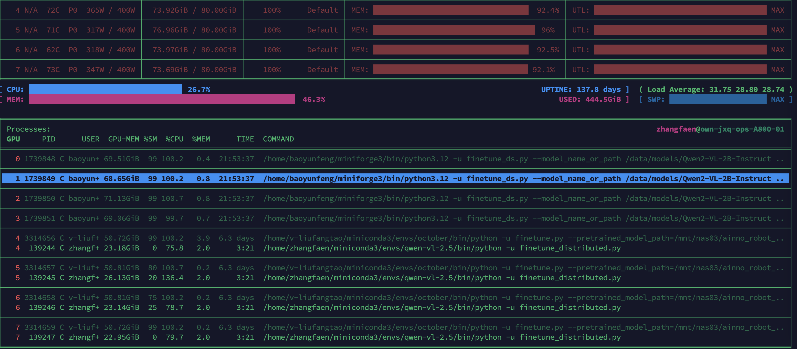
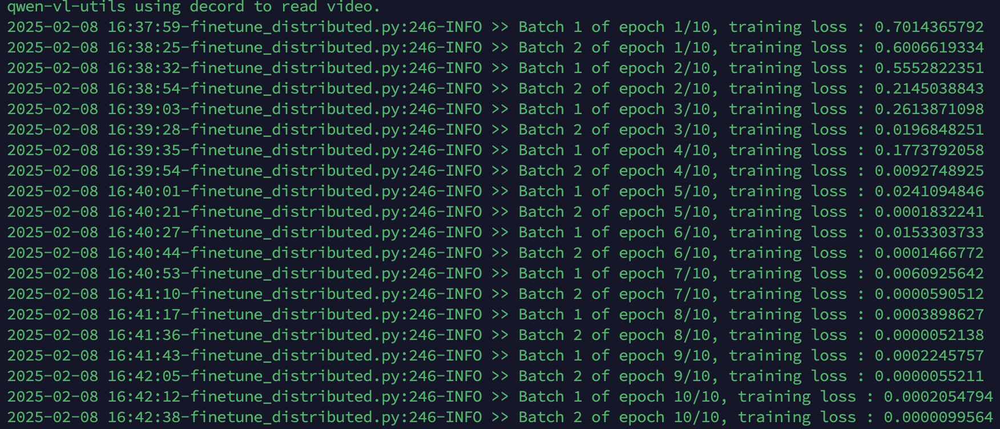

# Fine-tuning Qwen2.5-VL-3B


### News/Updates
* 2025/02/08
  * First version of the fine-tuning code is released.

### Introduction
In the past five months since Qwen2-VL’s release, numerous developers have built new models on the Qwen2-VL vision-language models, providing us with valuable feedback. During this period, qwen team focused on building more useful vision-language models. Today, qwen team are excited to introduce the latest addition to the Qwen family: Qwen2.5-VL.

   
    
I personally prefer simple and transparent code, so I wrote a fine-tuning code script for Qwen2.5-VL, hoping to help anyone who like to write their own training loops.  

I have a WeChat subscription account "Backpropagation", where I occasionally write some technical articles, including this one ( https://mp.weixin.qq.com/s/mN9Pxpd2Wciw1-IAoFc08A ), welcome to follow.
 

### Quick Start for Fine-tuning or continue pre-train Qwen2.5-VL 2B Model
---

```bash
%git clone https://github.com/zhangfaen/finetune-Qwen2.5-VL
%cd finetune-Qwen2.5-VL
%conda create --name qwen-vl-2.5 python=3.102
%conda activate qwen-vl-2.5
%pip install -r requirements.txt
```
**Note:**  
```
# When run "%pip install -r requirements.txt", it will install "deepspeed" package, which need nvcc tool. 
# Below is my environment configuration:
%export LD_LIBRARY_PATH=:/usr/local/cuda/lib64
%export CUDA_HOME=/usr/local/cuda
%export PATH=$PATH:/usr/local/cuda/bin

%which nvcc
/usr/local/cuda/bin/nvcc

%nvcc --version
nvcc: NVIDIA (R) Cuda compiler driver
Copyright (c) 2005-2024 NVIDIA Corporation
Built on Thu_Mar_28_02:18:24_PDT_2024
Cuda compilation tools, release 12.4, V12.4.131
Build cuda_12.4.r12.4/compiler.34097967_0
```

You can run the following command to begin:
```bash
./finetune_distributed.sh # Note that the CUDA_VISIBLE_DEVICES variable in this file should be set to the appropriate value
```   

### Test the Fine-tuned Model

---
```bash
%python test_on_trained_model_by_us.py # Test our fine-tuned or retrained Qwen2.5-VL 3B model
```   
Note: The test_on_trained_model_by_us.py file defines model_dir. If you have fine-tuned multiple models, you can modify this file to specify the path of your fine-tuned model.


The above test_on_trained_model_by_us.py both describe the two pictures under test_data/.


Overall, the fine-tuned model seems to have not been greatly affected in performance. The following picture is a log file during the fine-tuning process.
   
   
It can be seen that the training loss is decreasing, indicating that the model has converged during the training process.

