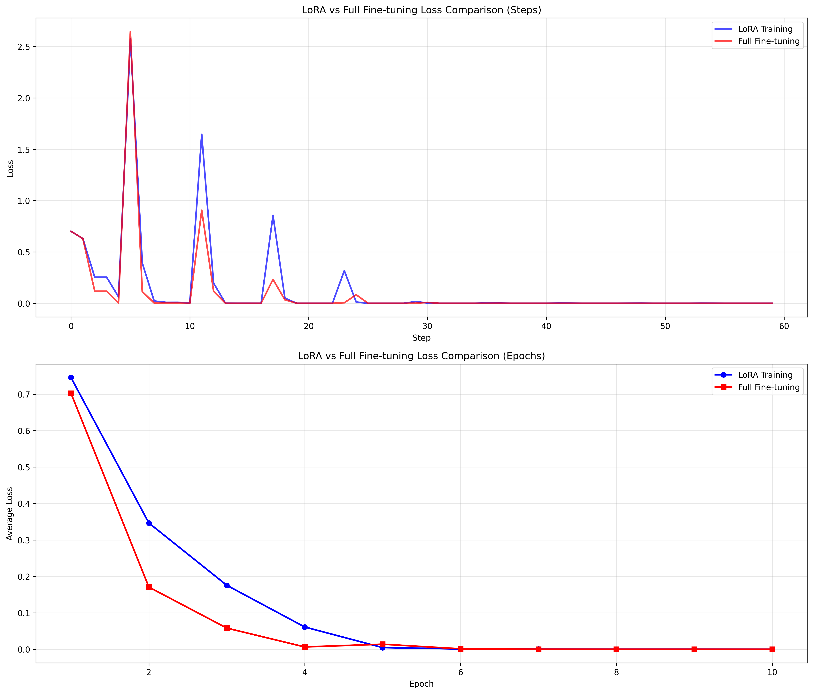

# LoRA Fine-tuning for Qwen2.5-VL

This repository contains code for fine-tuning Qwen2.5-VL models using LoRA (Low-Rank Adaptation) and comparing it with full fine-tuning.

## Features

- **LoRA Fine-tuning**: Efficient parameter-efficient fine-tuning using LoRA
- **Full Fine-tuning**: Traditional full parameter fine-tuning
- **Loss Comparison**: Automatic comparison of training curves between LoRA and full fine-tuning
- **Distributed Training**: Support for multi-GPU training with DeepSpeed
- **Loss Visualization**: Detailed loss plots and analysis

## Installation

1. Install the required dependencies:

```bash
%conda create --name qwen-vl-2.5 python=3.135 # the newest (0806)
%conda activate qwen-vl-2.5
%pip install -r requirements.txt
```


## Usage

### Training (Single-GPU & Multi-GPU)

To run LoRA or full fine-tuning on either a single GPU or multiple GPUs, please use the `finetune_distributed.sh` script. You can switch between single-GPU and multi-GPU training by editing the `CUDA_VISIBLE_DEVICES` and `--num_processes` parameters in the script:

- **Multi-GPU training (default configuration):**
  ```bash
  bash finetune_distributed.sh
  ```
  The script is pre-configured for 4 GPUs. Adjust `CUDA_VISIBLE_DEVICES` and `--num_processes` as needed for your setup.

- **Single-GPU training:**
  Uncomment and modify the single-GPU line in `finetune_distributed.sh`:
  ```bash
  # CUDA_VISIBLE_DEVICES="4" accelerate launch --main_process_port=29919 --mixed_precision=bf16 --dynamo_backend=no --num_machines=1 --num_processes=1 --use_deepspeed finetune_distributed.py 
  ```
  Set the appropriate GPU index and ensure `--num_processes=1`.

- **LoRA vs Full Fine-tuning:**
  Set the environment variable `USE_LORA` in the script or your shell:
  ```bash
  export USE_LORA=1  # For LoRA fine-tuning
  export USE_LORA=0  # For full fine-tuning
  ```

For more details, refer to the comments inside `finetune_distributed.sh`.

### Comparison Training

Run both LoRA and full fine-tuning and generate comparison plots:

```bash
python run_comparison.py
```

## LoRA Configuration

The LoRA configuration is defined in `setup_lora_config()`:

```python
lora_config = LoraConfig(
    task_type=TaskType.CAUSAL_LM,
    inference_mode=False,
    r=16,  # LoRA rank
    lora_alpha=32,  # LoRA alpha parameter
    lora_dropout=0.1,  # Dropout probability
    target_modules=[
        "q_proj", "k_proj", "v_proj", "o_proj",
        "gate_proj", "up_proj", "down_proj"
    ],
    bias="none",
    use_rslora=False,
    use_dora=False,
)
```

### Key Parameters

- **r (rank)**: Controls the rank of the low-rank adaptation (default: 16)
- **lora_alpha**: Scaling parameter for LoRA weights (default: 32)
- **lora_dropout**: Dropout rate for LoRA layers (default: 0.1)
- **target_modules**: List of modules to apply LoRA to

## Learning Rates

- **LoRA Training**: `lr = 2e-4` (higher learning rate for efficient training)
- **Full Fine-tuning**: `lr = 1e-5` (lower learning rate for stability)

## Output Files

### Individual Training Runs

Each training run generates:

1. **Model files**: Saved in the output directory
2. **Loss plots**: 
   - `lora_loss_history.png` or `full_loss_history.png`
   - Step-wise and epoch-wise loss curves
3. **Loss data**: 
   - `lora_loss_data.json` or `full_loss_data.json`
   - Raw loss values for further analysis

### Comparison Results

The comparison script generates:

1. **Comparison plots**:
   - `training_comparison.png`: Side-by-side comparison of LoRA vs full fine-tuning
2. **Comparison data**:
   - `training_comparison.json`: Detailed comparison metrics

The final comparision result is as follows:
 